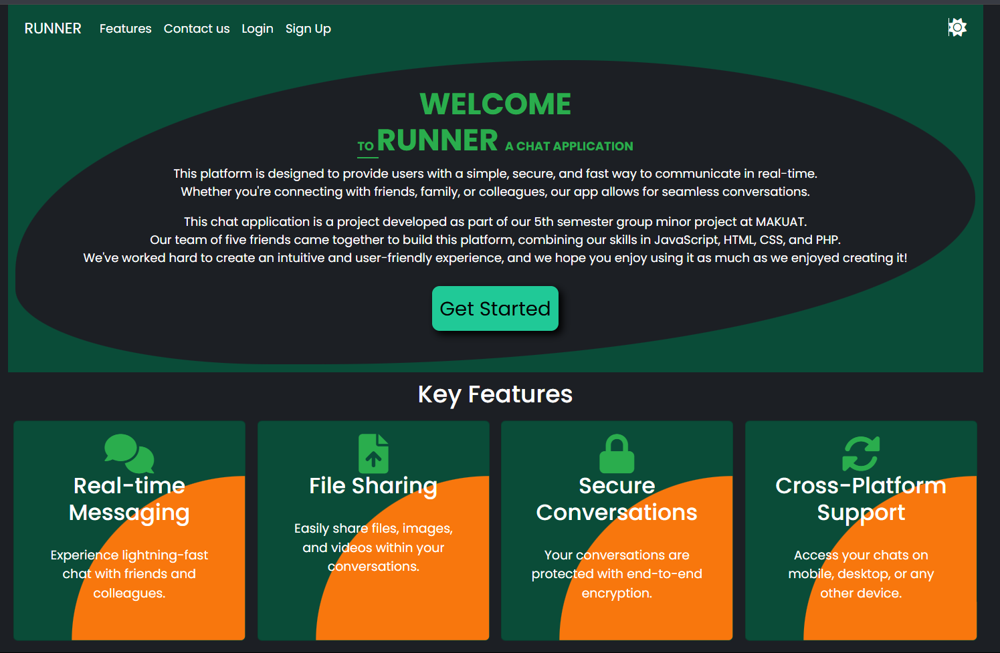
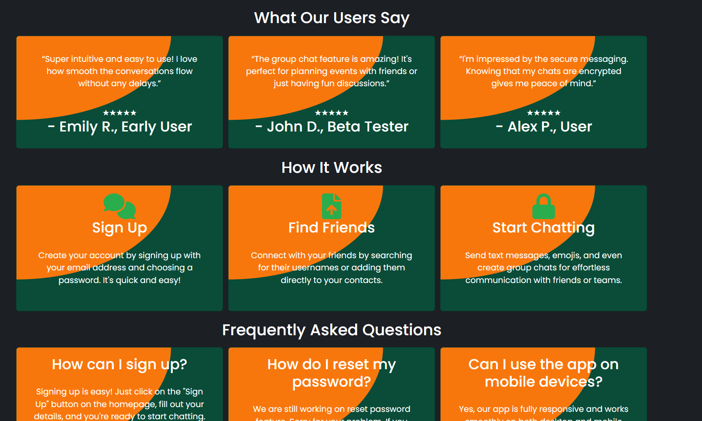
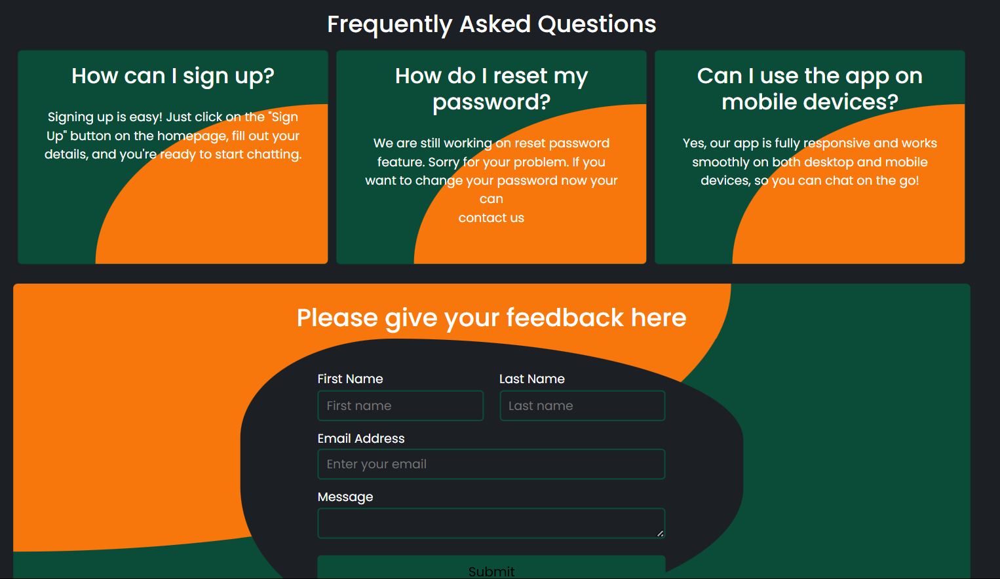
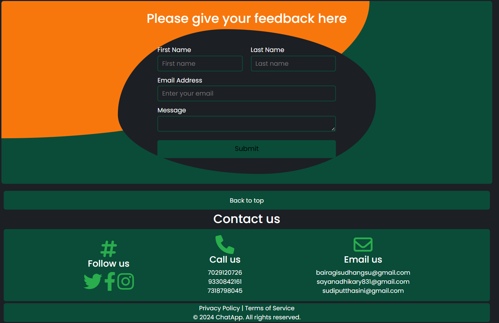
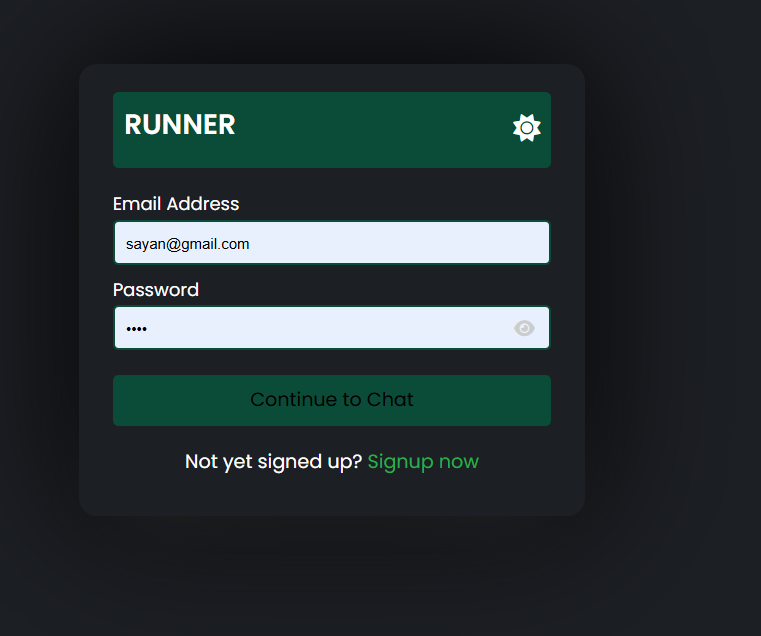
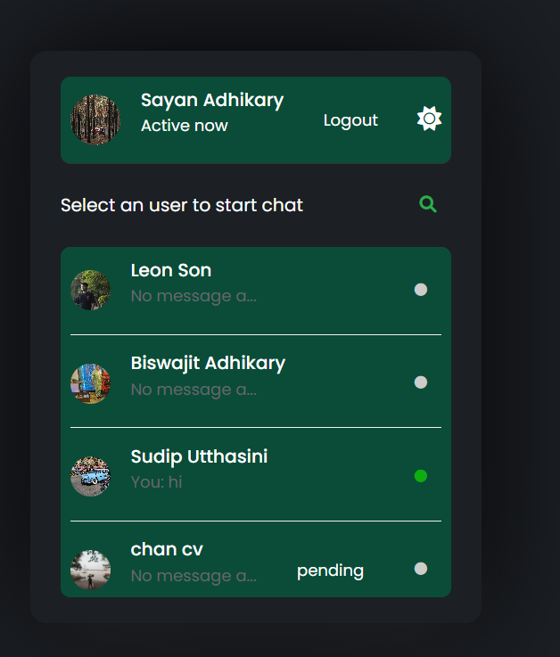
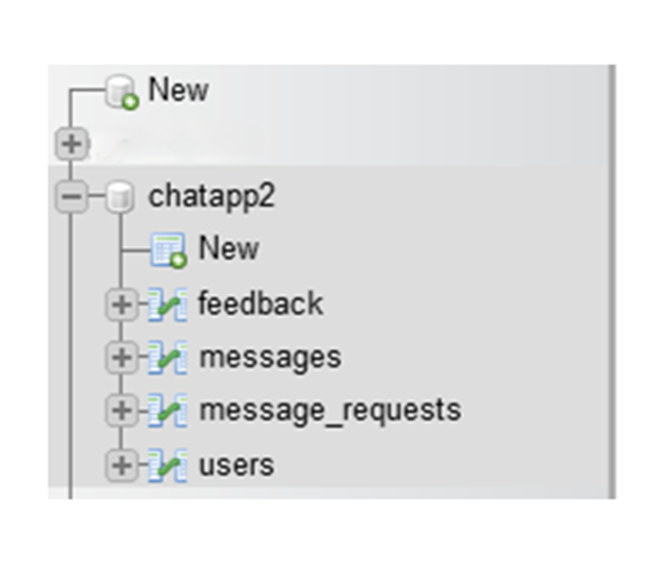

<h1>ChatApplication</h1>

<h2>Overview</h2>

ChatApplication is a web-based chat platform that allows users to communicate in real-time. The application is built using a combination of front-end and back-end technologies and incorporates a MySQL database for storing user and message data.

<h2>Features</h2>

<ul>
  <li>Real-time messaging functionality</li>
  <li>User authentication and session management</li>
  <li>Responsive design for seamless usage on desktop and mobile devices</li>
  <li>Chat room creation and management</li>
  <li>User-friendly interface</li>
  <li>Database integration for secure and efficient data storage</li>
</ul>

<h2>Technologies Used</h2>

<ul>
  <li>HTML: For structuring the web pages</li>
  <li>CSS: For styling the application</li>
  <li>JavaScript: For interactivity and client-side functionality</li>
  <li>XML: For data transport (if applicable)</li>
  <li>PHP: For server-side processing</li>
  <li>MySQL: For database management</li>
</ul>

<h2>Installation</h2>

<h3>Prerequisites</h3>

<ul>
  <li>A web server like Apache or Nginx</li>
  <li>PHP installed on your server</li>
  <li>MySQL database setup</li>
</ul>

<h3>Steps</h3>

<ol type = "1">
  <li>Clone the repository to your local machine:  <code>git clone https://github.com/leoGoD10/Chat-Application.git</code></li>
   <li>Navigate to the project directory:  <code>cd chatapplication</code></li>
   <li>Import the database:  
     <ul>
       <li>Locate the SQL file (e.g.,<code> chatapp.sql</code>) in the project folder.</li>
       <li>Use a tool like phpMyAdmin or MySQL CLI to import the file: <code> mysql -u (username) -p (database_name)  chatapp.sql</code></li>
     </ul>
   </li>
   <li>Configure the database connection:  
   <ul>
     <li>Open the config.php file.</li>
     <li>Update the database credentials (host, username, password, database name) to match your setup.</li>
   </ul>
   </li>
   <li>Start the application:  
     <ul>
       <li>If using XAMPP, move the project folder to the htdocs directory.</li>
        <li>Access the application in your browser at http://localhost/chatapplication.</li>
     </ul>
   </li>
</ol>

<h2>Usage</h2>

<ol type = "1">
  <li>Register a new account or log in with existing credentials.</li>
  <li>Join an existing chat room or create a new one.</li>
  <li>Start sending messages in real-time.</li>
</ol>

<h1>Folder Structure</h1>

<ul>
  <li>/css: Contains stylesheets for the application.</li>
  <li>/js: Contains JavaScript files for interactivity.</li>
  <li>/php: Contains server-side scripts.</li>
  <li>/database: Contains the SQL file for database setup.</li>
  <li>/index.html: The main landing page.</li>
</ul>

<h2>Demo</h2>

<h3>HOME Page</h3>

<h3>Signup page</h3>

<h3>Login page</h3>

<h3>Notification area</h3>

<h3>Chat area</h3>

<h3>Database</h3>

<h2>Contributing</h2>

Contributions are welcome! If you want to contribute:

<ol type = "1">
  <li>Fork the repository.</li>
  <li>Create a new branch for your feature or bugfix:  <code>git checkout -b feature-name</code></li>
  <li>Commit your changes:  <code> git commit -m "Describe your changes"</code></li>
  <li>Push to your branch:  <code>git push origin feature-name</code></li>
  <li>Open a pull request.</li>
</ol>

<h1>Acknowledgments</h1>
<ul>
  <li><a href="https://www.php.net/docs.php" target="_blank">PHP Documentation</a></li>
  <li><a href="https://dev.mysql.com/doc/" target="_blank">MySQL Documentation</a></li>
  <li>Open-source libraries and tools used in the project</li>
</ul>
