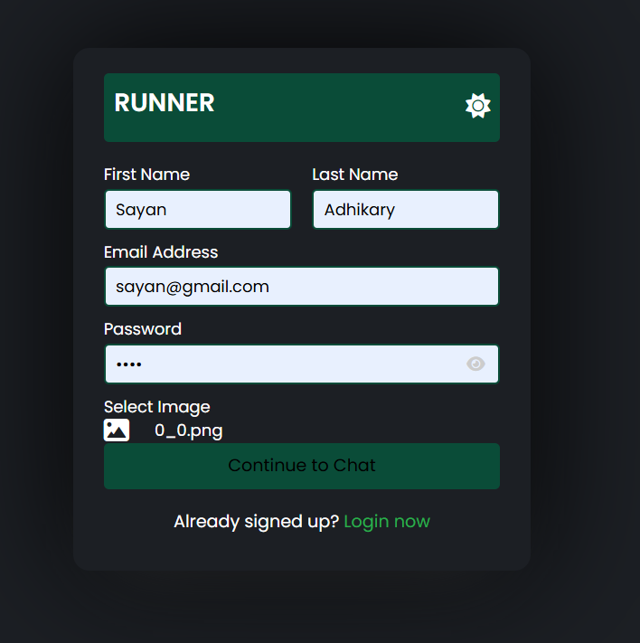
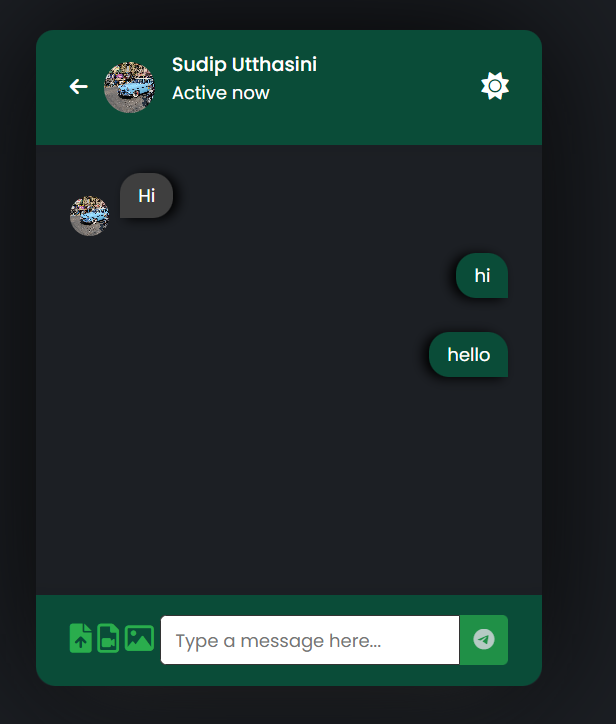

# ChatApplication

## Overview

ChatApplication is a web-based chat platform that allows users to communicate in real-time. The application is built using a combination of front-end and back-end technologies and incorporates a MySQL database for storing user and message data.

## Features

- Real-time messaging functionality
- User authentication and session management
- Responsive design for seamless usage on desktop and mobile devices
- Chat room creation and management
- User-friendly interface
- Database integration for secure and efficient data storage

## Technologies Used

- HTML: For structuring the web pages
- CSS: For styling the application
- JavaScript: For interactivity and client-side functionality
- XML: For data transport (if applicable)
- PHP: For server-side processing
- MySQL: For database management

## Installation

### Prerequisites

- A web server like Apache or Nginx
- PHP installed on your server
- MySQL database setup

### Steps

1. Clone the repository to your local machine:  
   `git clone https://github.com/leoGoD10/Chat-Application.git`

2. Navigate to the project directory:  
   `cd chatapplication`

3. Import the database:  
   - Locate the SQL file (e.g., `chatapp.sql`) in the project folder.  
   - Use a tool like phpMyAdmin or MySQL CLI to import the file:  
     `mysql -u (username) -p (database_name) < chatapp.sql`

4. Configure the database connection:  
   - Open the config.php file.  
   - Update the database credentials (host, username, password, database name) to match your setup.

5. Start the application:  
   - If using XAMPP, move the project folder to the htdocs directory.  
   - Access the application in your browser at http://localhost/chatapplication.

## Usage

1. Register a new account or log in with existing credentials.
2. Join an existing chat room or create a new one.
3. Start sending messages in real-time.

## Folder Structure

- /css: Contains stylesheets for the application.
- /js: Contains JavaScript files for interactivity.
- /php: Contains server-side scripts.
- /database: Contains the SQL file for database setup.
- /index.html: The main landing page.

## Demo

### HOME Page

  
  
  

### Signup page

### Login page

### Notification area

### Chat area

### Database

## Contributing

Contributions are welcome! If you want to contribute:

1. Fork the repository.
2. Create a new branch for your feature or bugfix:  
   `git checkout -b feature-name`
3. Commit your changes:  
   `git commit -m "Describe your changes"`
4. Push to your branch:  
   `git push origin feature-name`
5. Open a pull request.

## Acknowledgments

- [PHP Documentation](https://www.php.net/docs.php)
- [MySQL Documentation](https://dev.mysql.com/doc/)
- Open-source libraries and tools used in the project
